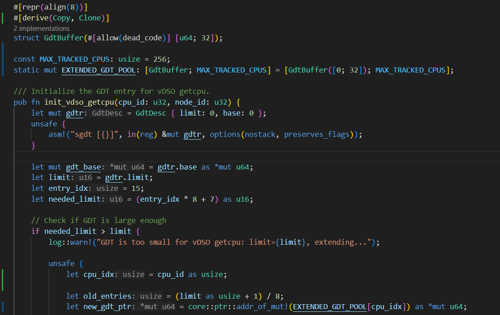
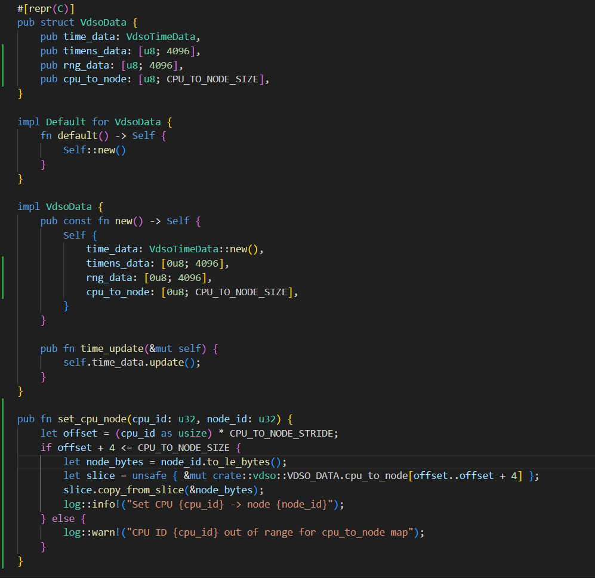
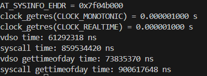
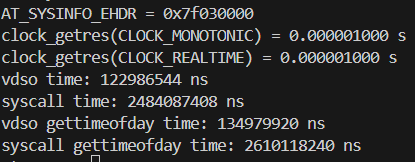
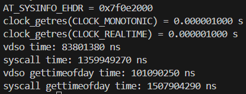
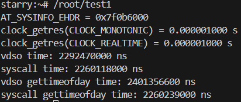
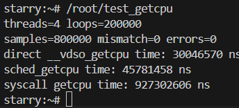
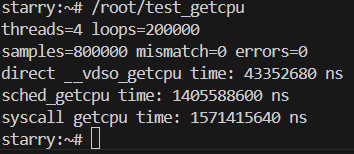
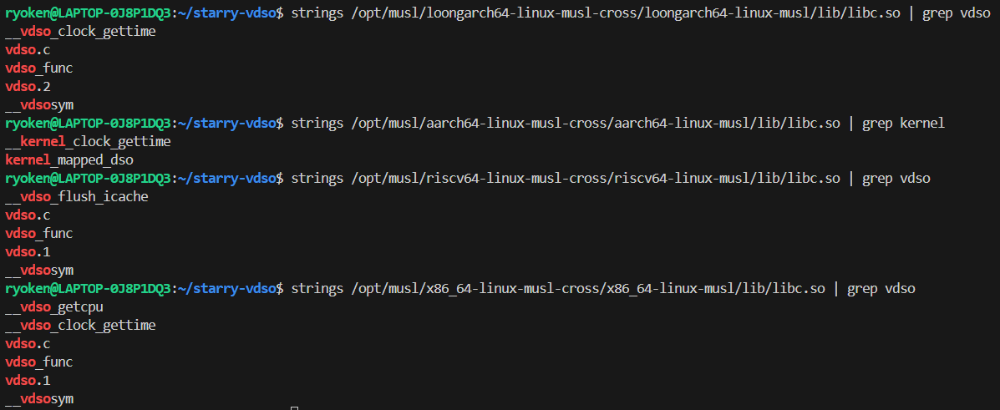

# starry-vdso 开发笔记

## getcpu 开发笔记

### x86_64

此前负责本工作的同学已经完成了基本框架

但在多个核同时初始化时 GDT 内容会被其他核覆盖 在此为每个 cpu 分配独立 GDT 空间

### loongarch64

loongarch64 与 x86 架构的 vdso_getcpu 实现不太一样

x86 是读 GDT 内信息 而 loongarch64 是根据特定偏移读 vvar 数据页

在此处扩展了 vdsodata 结构 并添加 `set_cpu_node` 把 node_id 写到正确的 vvar 偏移

### riscv64

#todo

## 时间相关 vdso 验证

### 测试程序

[test1](../apps/test1.c)

### x86_64

### aarch64

### loongarch64

### riscv64

riscv64 的 musl 没有提供 vdso_clock_gettime 的入口

https://github.com/orgs/Starry-OS/discussions/10#discussioncomment-15193232 中可以看到直接调用 vdso 的速度明显高于 syscall 路径

## getcpu 验证

starryOS 没有提供 sys_getcpu 为方便测试临时添加了一个简单的系统调用

### 测试程序

[test_getcpu](../apps/test_getcpu.c)

### x86_64

### loongarch64

### riscv64

#todo

### aarch64

vdso_aarch64.so 中没有 getcpu 符号 暂时跳过

## 遇到的问题

目前使用的 musl 工具链只支持部分 vdso 接口

不能通过 libc 自动走部分 vdso 路径