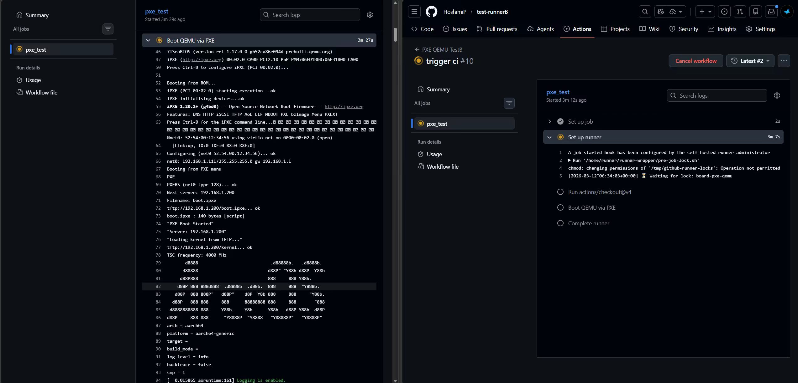
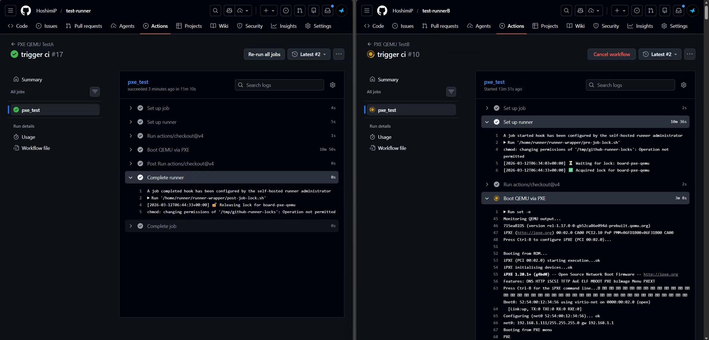
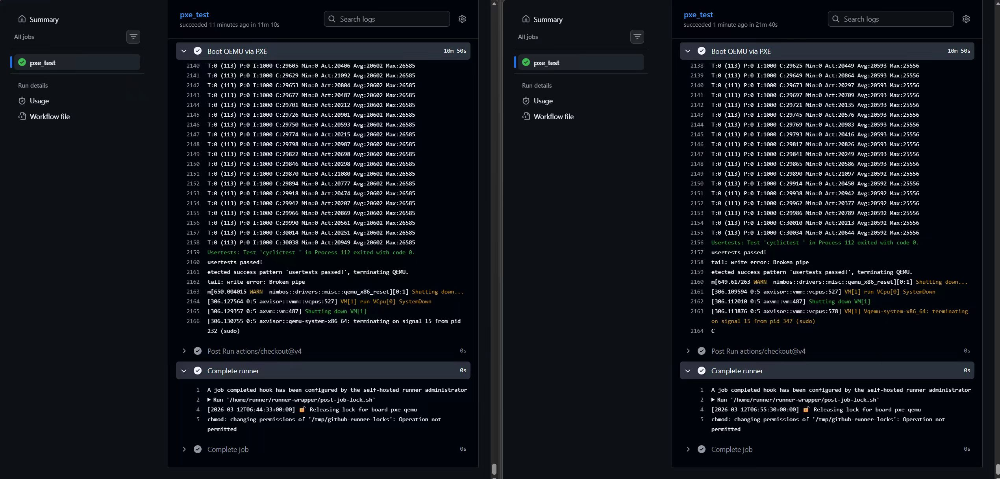
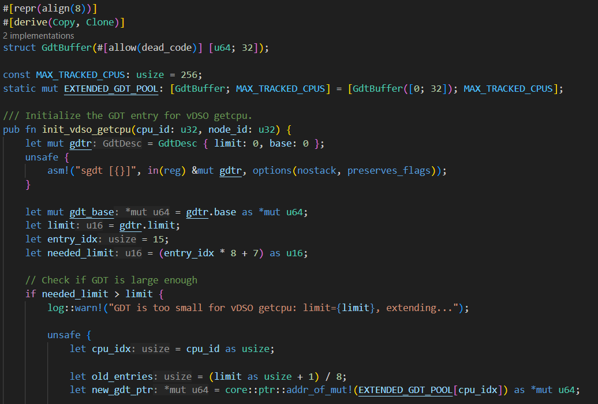
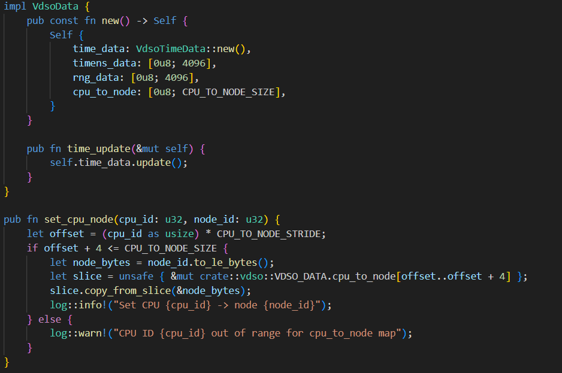
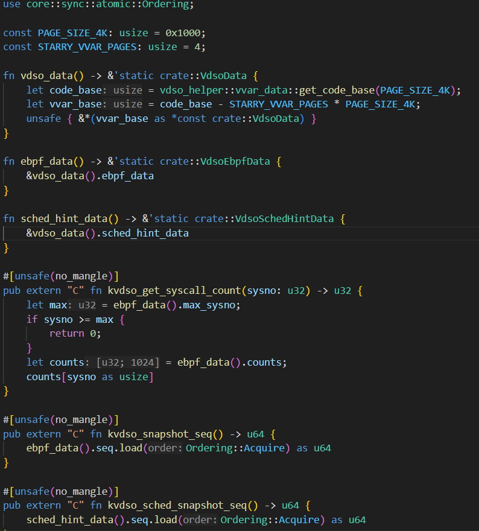
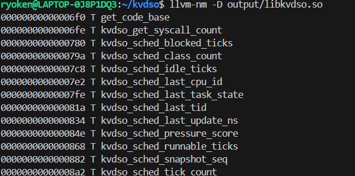
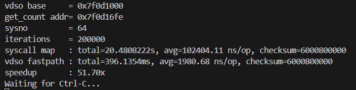
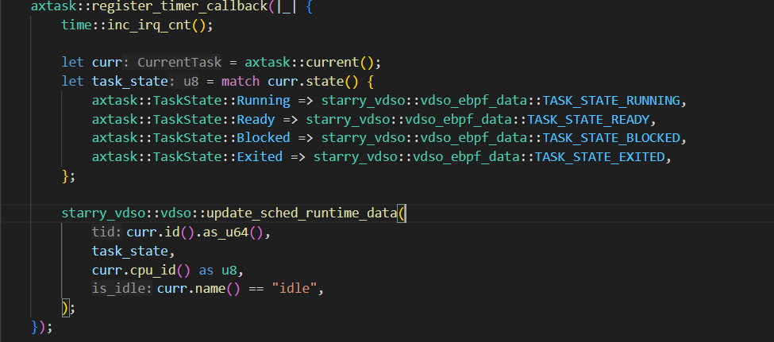

# 本次实习工作总结

## x86 自动化测试支持

1. 验证了 x86 平台使用 pxe 进行自动测试部署的流程，并编写[验证报告](notes/pxe_boot_validation.md)
2. 拆分 pxe 部署脚本，并与已有 [github-runners](https://github.com/HoshimiP/github-runners/tree/feat/pxe-setup) 结合，使其能够在 CI 中自动触发测试
3. 验证了部署流程与多组织资源锁 runner-wrapper 的适配，在 ubuntu+qemu 环境成功触发资源锁并执行完整测试

4. 由于本地环境限制（缺少物理开发板），将已完成部分交付给柏乔森老师负责真实硬件上的验证

## starry-vdso 的完善

1. 将 [starry-vdso](https://github.com/HoshimiP/starry-vdso) 接入 starryOS 验证时间相关函数已经能够走 vdso 路径 具体验证结果见[笔记](notes/vdso.md)
2. 修改了 x86 架构 getcpu 的初始化实现 为每个 cpu 分配独立 GDT 空间 解决多核场景下 CPU ID 获取不准确的问题
3. 实现了 loongarch64 架构的 vdso_getcpu

## 基于自定义 vDSO 接口的 fast path 设计与实现

1. 使用 [vdso-helper](https://crates.io/crates/vdso_helper) 编译包含自定义 fast path 的 `.so` 文件，并完成在 StarryOS 中的加载与调用

2. 优化 starry-vdso 的 vvar 映射逻辑 使用户态可以正常通过 vdso基地址+偏移量 访问自定义 vdso 接口

3. 在已有可加载模块 `modules/kebpf` 中增加 vdso 数据页的更新逻辑。当 eBPF 程序执行时，将结果从 map 写入 vvar，使用户态可以零系统调用读取结果，显著降低延迟

4. 在 `api/src/lib.rs` 处增加 vdso 数据页的更新逻辑，在 `register_timer_callback` 时同步更新 vvar 中的任务快照，确保 fast path 始终读取到最新状态
